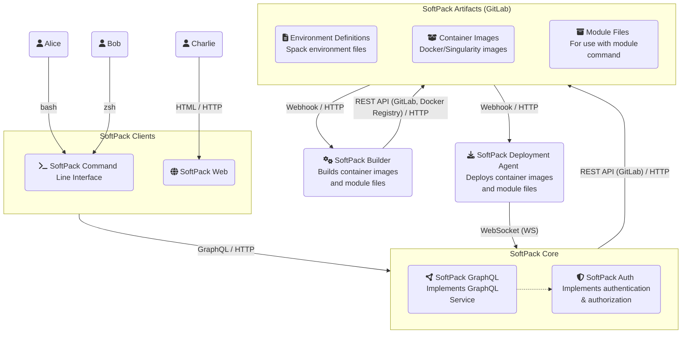
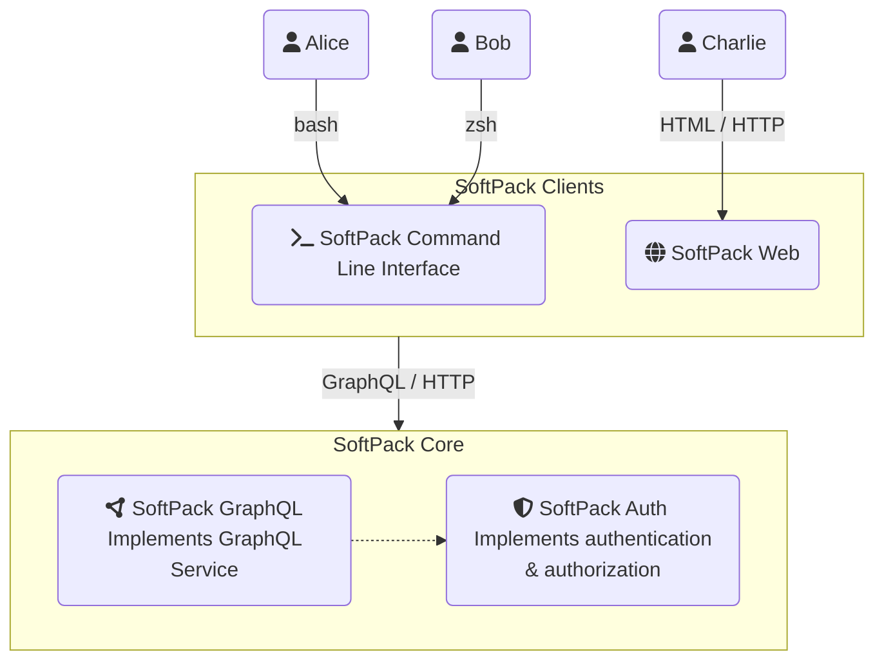
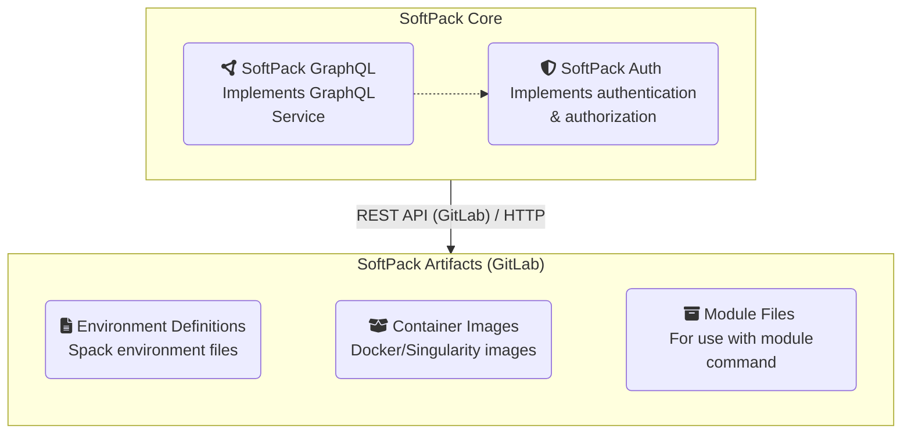
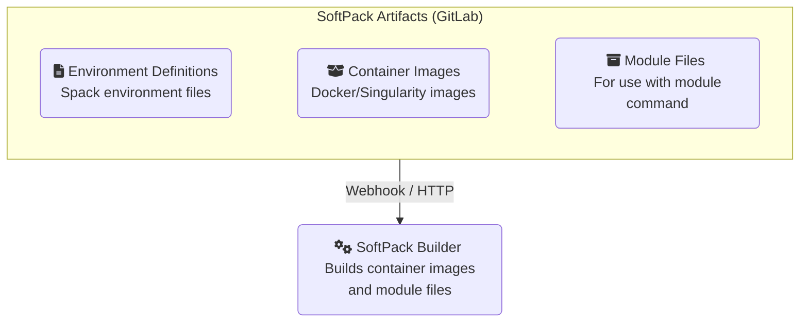
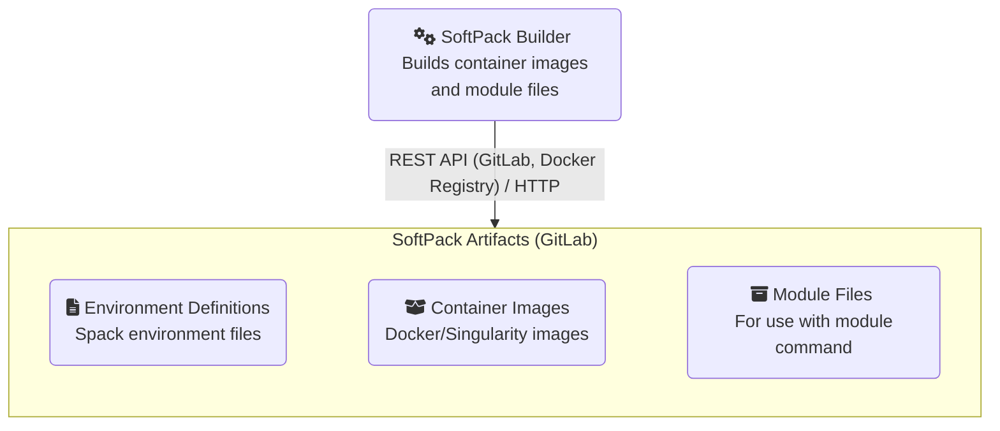
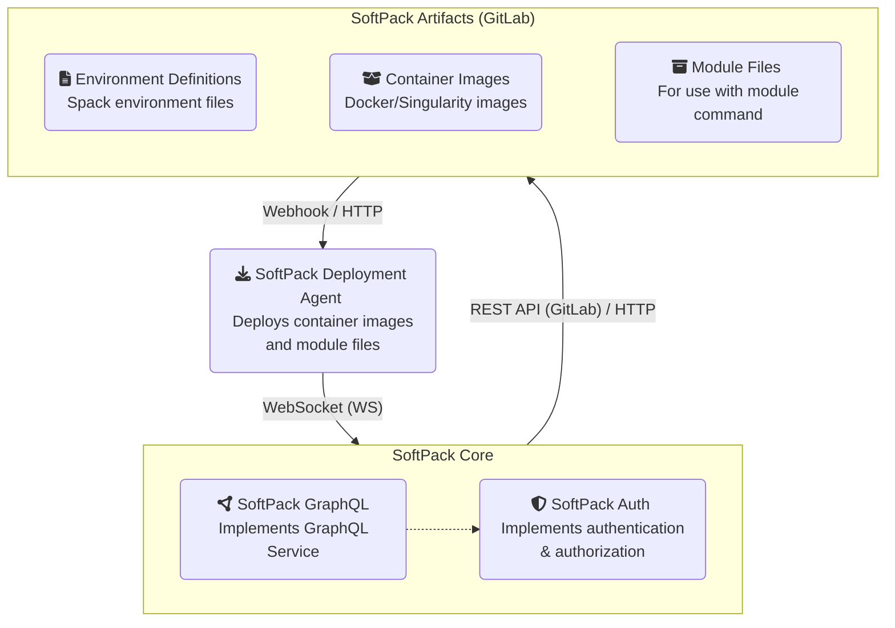
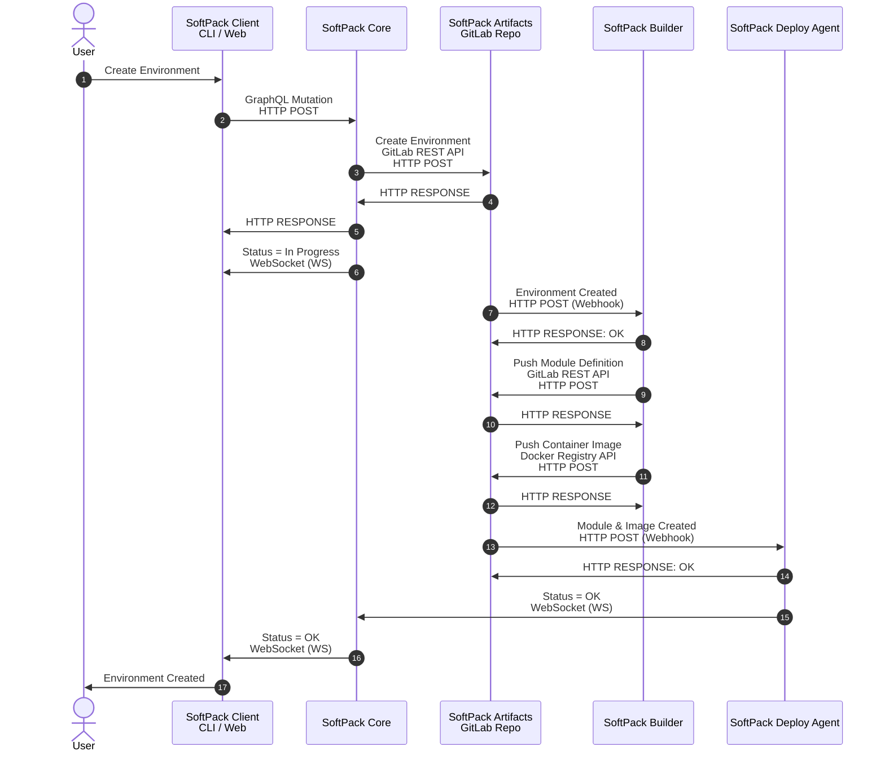

# System Architecture 

:::caution
This documentation is under development and may be incomplete.
:::

SoftPack is built using a modern [microservices architecture](https://letmegooglethat.com/?q=what+is+microservices+architecture). Unlike monolithic
monstrosities of the past, modern software systems are almost always built
with smaller lightweight services that interoperate together and communicate 
to each other using well-defined interfaces over standard protocols.

The architecture described here is composed of loosely-connected stateless 
services capable of being deployed, upgraded, restarted and scaled up, 
independent of other services in the system. Some services are more resource 
intensive than others and benefit from running in an environment where 
additional nodes can be added for load-balancing concurrent tasks. Other 
services, however, can happily operate a single-threaded FIFO queue without 
becoming a bottleneck in the system. In a microservice architecture, each 
service is capable of being scaled horizontally only when necessary and 
capacity planning decisions do not need to be made up front. 

**Notation**

A quick word about the notation used in the diagrams in the documentation 
before we proceed. 

1. Only uni-directional arrows are used in the diagrams below. This is by 
design. The notation `X → Y` should be read as, `X` uses `Y` or `X` calls `Y`, 
or `X` sends a message to `Y`.  Most inter-service communication requires 
bidirectional messaging. However, in a request-response framework, the request 
are response are rarely symmetric, so bidirectional arrows are generally 
misleading. Another arrow in the opposite direction denoting the response would
make more sense but that practice is avoided here to reduce unnecessary clutter.

2. The `/` symbol is used to denote layering of protocol or messaging in the 
stack and not an either/or substitution marker. For example, `HTML / HTTP` 
or `REST / HTTP` are read as `HTML` over `HTTP`, and `REST` over `HTTP` 
respectively.

1. Error conditions are excluded from the diagrams for brevity. The diagrams 
do not mean that every service will always return `status = OK`. Some 
operations will undoubtedly return errors but when a service encounters an 
error, it will propagate the error upwards in the stack and notify the caller
or log the event if necessary. 

## Bird's Eye View

A high-level schematic of SoftPack is illustrated below outlining each major
component in the system.
 


## SoftPack Clients



### SoftPack Command Line Interface (CLI)

SoftPack provides a Command Line Interface (CLI) for use in *nix shells either
interactively or in non-interactive scripting environments. The CLI offers
full coverage of the functionality offered by SoftPack including the ability
to create and manage your environments, and the ability to search and discover 
environments created and shared by others.

### SoftPack Web 

SoftPack Web provides a graphical interface for managing environments created 
with SoftPack. In contrast with the CLI, the web interface offers a more 
user-friendly experience when searching for environments created and shared by 
others; or searching for available packages from a large collection; or narrowing 
down the search based on specific versions of a package. The web interface can 
also be used to monitor the status of in-progress tasks such as environment 
creation requests initiated from the CLI.

## SoftPack Core



SoftPack Core implements a service that listens to requests from SoftPack
clients and uses GitLab API to create, update or delete environments in the 
SoftPack Artifacts repository. 

### SoftPack GraphQL

SoftPack GraphQL implements the [GraphQL](https://graphql.org) service in 
SoftPack. GraphQL is used because of the flexibility it offers when performing 
complex queries. Unlike REST APIs where multiple queries from multiple 
endpoints often require complex logic to be embedded in client interfaces, 
GraphQL provides a query language that can span multiple sources, allowing the 
server to optimise query results and reduce the amount of roundtrip calls a 
client needs to make to perform a complex query.

### SoftPack Auth

SoftPack Auth is an internal component of SoftPack Core responsible for 
implementing authentication and authorization support.

Authentication is only necessary when the client is connected using SoftPack 
CLI. SoftPack Web leverages LDAP and Okta support in Nginx and does not need to 
perform its own authentication. 

Authorization is carried out over LDAP regardless of whether the client is 
connected using SoftPack CLI or SoftPack Web to verify that the user is 
authorized to carry out the tasks they're attempting to perform.

## SoftPack Artifacts



SoftPack Artifacts is a GitLab repository that stores the following for each 
environment:

- An environment file that defines the packages that are part of the 
environment and any dependencies.
- A module file that allows the environment to be loaded using the `module` 
command.
- Docker or singularity images stored in the container registry of the 
repository.
- metadata (yet-to-be-defined) for controlling visibility (private vs public) 
and permissions (users or groups authorized to update the environment other 
than the owner)

Only SoftPack Core and SoftPack Builder are allowed to push changes to the 
repository. End-users can only see the contents of the repository using 
SoftPack CLI or SoftPack Web. Direct access to the repository is neither 
allowed, nor required.

SoftPack Artifacts repository is structured to allow for environments to be 
created and stored under a user or group hierarchy. This is how ownership of
an environment is determined and prevents one user from modifying another user's 
environment without explicit permission. 

In the illustration below, a simplified view of the repository is shown with
users alice, bob, and charlie; groups named after capital cities (athens, 
baku and cairo); and environments named after elements from the periodic table.

```
/
├── groups
│   ├── athens
│   │   └── environments
│   │       └── zinc
│   ├── baku
│   │   └── environments
│   │       ├── lithium
│   │       └── scandium
│   └── cairo
│       └── environments
│           ├── osmium
│           └── radium
└── users
    ├── alice
    │   └── environments
    │       ├── helium
    │       └── nitrogen
    ├── bob
    │   └── environments
    │       ├── potassium
    │       └── radon
    └── charlie
        └── tungsten
```

## SoftPack Builder



SoftPack Builder is a lightweight service that listens to WebHooks from 
SoftPack Artifacts repository and proceeds to build a container image for the 
environment along with a module file. The module file is pushed to the repository
in the environment's subdirectory while the container image is pushed to the 
container registry and optionally applies any tags requested by the user.

## SoftPack Deploy Agent



SoftPack Deploy Agent is another lightweight service that listens to
WebHooks from SoftPack Artifacts repository and deploys a module file and
container image built by SoftPack Builder.

The location of where the agent deploys the container image and module file
depends on the configuration of the agent. (TBD)

## Usage Scenarios

Putting all the pieces together, we can now proceed to walk through a typical 
scenario of a user creating a new environment.

### Creating a new environment

This section describes the sequence of events generated from an end-user's 
request to create a new environment.

The SoftPack CLI and SoftPack Web clients operate in a similar fashion and
communicate only to the SoftPack Core. The synchronous command line interface 
is similar to the asynchronous web interface with one exception that the 
command line does not return control to the user until the request has 
propagated through the system and the operation has completed.

The following sequence diagram illustrates the interaction between the various
components of the system resulting from a request to create a new environment 
from the user. Each step of this sequence is explained in the table that 
follows the sequence diagram.



### Event Sequence

| #   | Event                                                              | Description                                                                                                                                                |
|-----|--------------------------------------------------------------------|------------------------------------------------------------------------------------------------------------------------------------------------------------|
| 1   | Create Environment                                                 | End-user sends a request to create a new environment using either the Web Client or the Command Line Interface.                                            |
| 2   | GraphQL Mutation                                                   | SoftPack client sends the request to create a new environment using GraphQL Mutation over HTTP                                                             |
| 3   | Create Environment in SoftPack Artifacts repository                | SoftPack Core creates a new environment in SoftPack Artifacts repository                                                                                   | 
| 4   | HTTP RESPONSE<br/>Status = OK                                      | SoftPack Artifacts repository returns `OK` to SoftPack Core                                                                                                |
| 5   | HTTP RESPONSE<br/>Status = OK                                      | SoftPack Core returns `OK` to the client                                                                                                                   |
| 6   | WebSocket (WS) <br/> Status = In Progress                          | SoftPack Core sends `In Progress` status to the client in a WebSocket notification                                                                         | 
| 7   | Environment Created Webhook from SoftPack Artifacts repository     | SoftPack Artifacts repository sends a Webhook notification to the Softpack Builder that a new environment has been created                                 |
| 8   | HTTP RESPONSE<br/>Status = OK                                      | SoftPack Builder returns OK to SoftPack Artifacts repository                                                                                               |
| 9   | Push Module Definition from SoftPack Builder                       | SoftPack Builder pushes a new module definition file to SoftPack Artifacts repository                                                                      |
| 10  | HTTP RESPONSE<br/>Status = OK                                      | SoftPack Artifacts repository returns OK to SoftPack Builder                                                                                               |
| 11  | Push Container Image from SoftPack Builder                         | SoftPack Builder pushes a new container image to SoftPack Artifacts repository                                                                             |
| 12  | HTTP RESPONSE<br/>Status = OK                                      | SoftPack Artifacts repository returns OK to SoftPack Builder                                                                                               |
| 13  | Module & UImage Created Webhook from SoftPack Artifacts repository | SoftPack Artifacts repository sends a Webhook notification to the SoftPack Deploy Agent that a new module definition and container image have been created |
| 14  | HTTP RESPONSE<br/>Status = OK                                      | SoftPack Deploy Agent returns OK to SoftPack Artifacts repository                                                                                          |                                              
| 15  | WebSocket (WS) <br/> Status = OK                                   | SoftPack Deploy Agent sends `OK` to SoftPack Core once the module file and container images are deployed                                                   |
| 16  | WebSocket (WS) <br/> Status = OK                                   | SoftPack Core sends `OK` to SoftPack client that the new environment has been created                                                                      |
| 17  | Environment Created                                                | SoftPack client updates the status and notifies that user that their new environment has been created                                                      |
