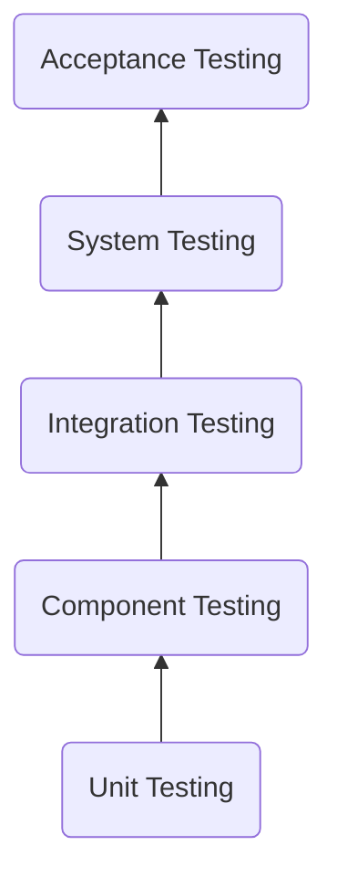

# Testing Strategy

:::caution
This documentation is under development and may be incomplete.
:::

A comprehensive testing strategy generally involves the following five stages:

## Unit Testing

Unit testing attempts to test the smallest units of code within each component.
In general, unit testing is performed at the interface, class or file level 
where each source file includes a separate test counterpart responsible for 
testing its functionality. Most, if not all unit testing should be performed 
automatically and should be integrated in the Continuous Integration workflows. 

### GitHub CI/CD workflows

The following table summarizes GitHub workflows that are part of CI/CD and the
coverage they provide.

| Workflow | Branch/Tag   | Coverage |
|----------|--------------|----------|
| Dev | branch: main | |
| Preview | branch: main | |
| Release | tag: v* | | 

## Component-level Testing

Each component implements its own test suite and defines a set of tests that 
must pass before integration testing.

Refer to the [Test Plan](/docs/reference/test_plan) for details about 
testing requirements for each component.

## Integration Testing

When two or more components are integrated, a suite of tests that defines the
interaction between the components must be run before integration is completed.

Refer to the [Test Plan](/docs/reference/test_plan) for details about
 requirements for the integration testing phase.

## System Testing

System tests are carried out on an integrated system to ensure the system as a
whole performs as expected. 

Refer to the [Test Plan](/docs/reference/test_plan) for details about
system testing requirements.

## Acceptance Testing

Acceptance testing is performed to ensure the product meets the specified 
requirements and the intended feature sets.

Refer to the [Test Plan](/docs/reference/test_plan) for details about
 requirements for acceptance testing.

